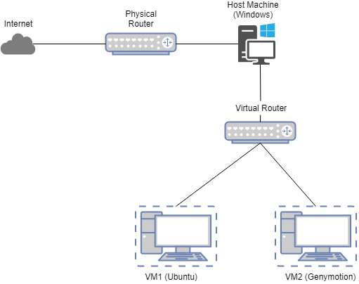
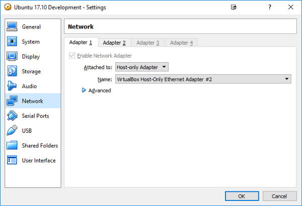
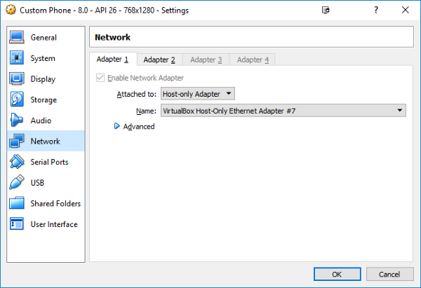
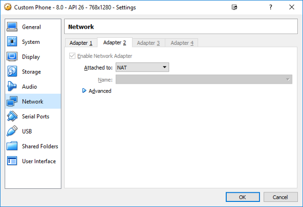
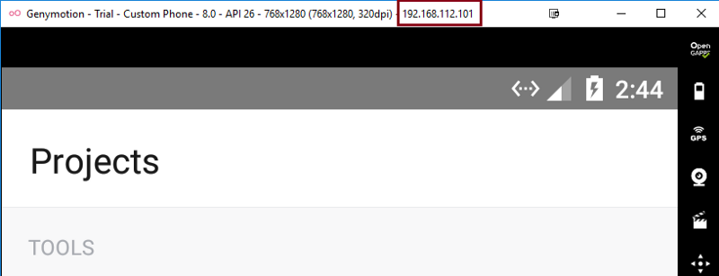
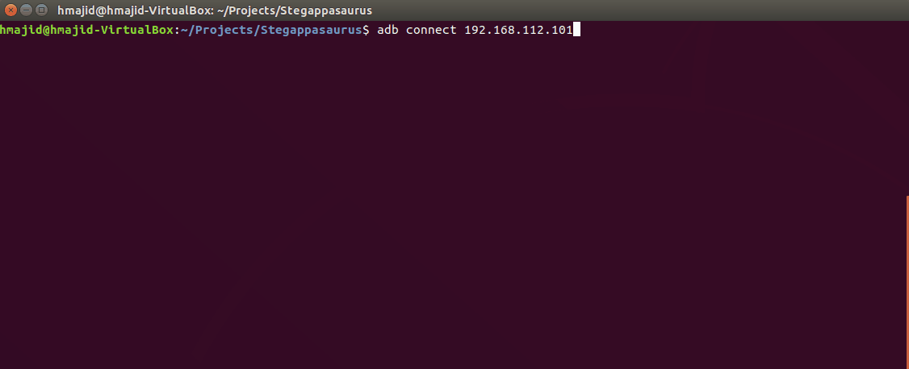

My home PC runs Windows for various conveniences, such as gaming. However, for development, I run an Ubuntu virtual
machine (VM) and Genymotion (on Windows) for testing my app. Genymotion also uses VirtualBox to run its Android
emulators. So we work out how to let two VMs running on the same host communicate with each other
(Ubuntu and Android Emulator).

**Please Note:** This will also work for VMWare Player.

## Solution

There are a few networking options we can choose from when setting up a VM.

- **NAT**: Allows your VMs so communicate with the outside world (outbound network), but your host machine (Windows)has no way to access this network

- **Bridged**: Allows your VMs to access a network using the host computer's Ethernet adapter. However this adds a bit of complexity, as your VM needs it own identity on the network as essentially its treated like another physical machine.

- **Host-only**: Acts a hybrid between the other two options. It allows your VM to communicate with your host machine. So essentially all we need for multiple VMs to communicate with each is other is to turn on Host-only network (on all VMs). This allow them to communicate with the host machine which will act as a "bridge" (no pun intended).



## Prerequisites

- [VirtualBox](https://www.virtualbox.org/wiki/Downloads) Installed on the host machine
- An [Expo](https://docs.expo.io/versions/latest/workflow/create-react-native-app) app in the (Ubuntu) development VM
- [Genymotion](https://www.genymotion.com/desktop/) Installed and setup on the host machine

## VirtualBox

- Open up VirtualBox
- Click on the development VM and open the "Settings".
- Go to "Network" and Set the following two adapters, as shown in Figure 1
- Adapter 1: "Host-only Adapter"
- Adapter 2: "NAT"

NAT allows the Ubuntu VM to use the host machines internet access, it allows it to communicate with the outside world.
The Host-only Adapter allows the Ubuntu VM to communicate with other VM, such as the Genymotion Android emulator.




## Genymotion

Genymotion network settings are pretty much the same as the Ubuntu VM, as shown in Figure 2. Please note that the
Host-only adapters can be the same (i.e. #7).




## Expo

- Start your Genymotion Android emulator.
- Start your Ubuntu VM and open a terminal.
- Replace the IP Address with your own one, you can find your IP address on the Android emulator. As shown in Figure 3.

```bash
adb connect 192.168.112.101
exp start
exp android
```



That's it you should see your app running on the Genymotion Android emulator now. You can see how to start the
application below in Figure 4.



## Appendix

- GIFs created with [screentogif](https://www.screentogif.com/)
- [Detailed post about VirtualBox Networking](http://bertvv.github.io/notes-to-self/2015/09/29/virtualbox-networking-an-overview/)
- Drawing made with [draw.io](https://www.draw.io/)
