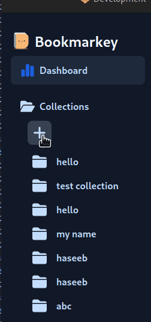

**TIL: How to Autofocus on Inputs in Svelte**

In this post, I will show you how you can autofocus on input that is in a child component.
So in my use case, I want the user to click a button to add a "collection" and then it will show the input
and immediately focus on it. Which looks something like this:



So how can we do this?

Let's say we have a child component called `Input.svelte` which looks like this:

```svelte
<script lang="ts">
	export let type: string;
	export let name: string;
	export let ref: HTMLInputElement | undefined = undefined;
</script>

<input bind:this={ref} {name} {type} />
```

The key prop here is `ref`, which we will use to focus on our input.
`ref` is a reference to the component itself.
Then in our parent component say called `AddCollection.svelte` we can do something like:

```svelte {hl_lines=[9-10]}
<script lang="ts">
	import { tick } from "svelte";
    let ref: HTMLInputElement;
</script>


<button
	on:click={async () => {
		await tick();
		ref?.focus();
	}}>
	Add Collection
</button>
<Input bind:ref type="text" name="addCollection" />
```


In the parent component, we want to use `bind:ref`, as we don't want to bind to the `Input`
but pass the prop to the child and also bind our variable to it.

If we do `bind:this={ref}` in `AddCollection.svelte` this will not work as far as I know.


That's it!

## Appendix

- Revelant [SO Post](https://stackoverflow.com/questions/57354001/how-to-focus-on-input-field-loaded-from-component-in-svelte)
