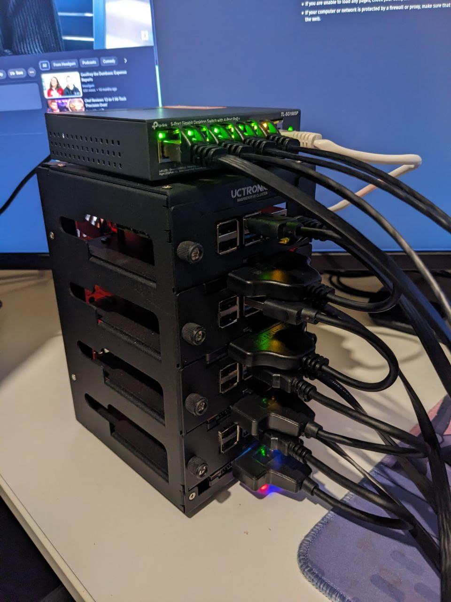
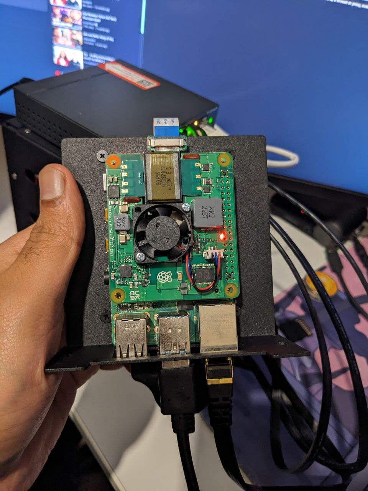
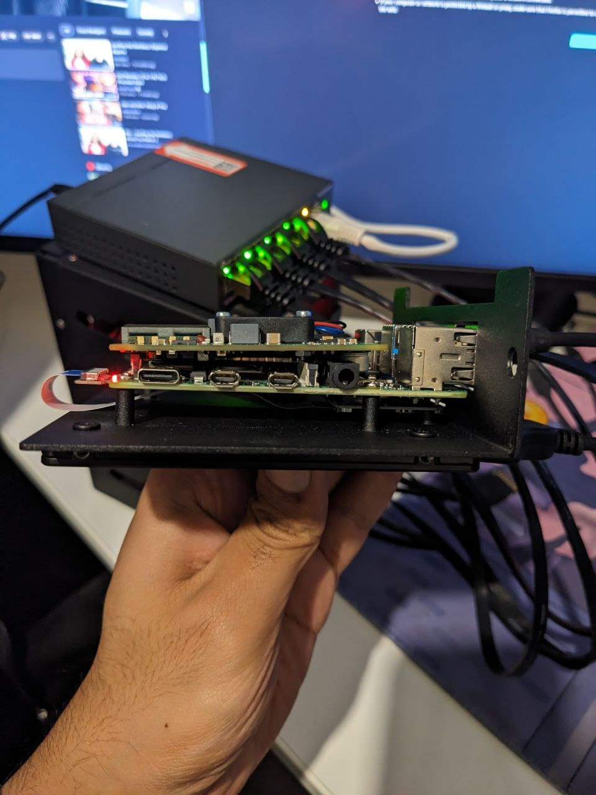

## Background

Recently, I proceeded to experiment with some Raspberry PIs (RPI) that I had lying around. I wanted to do something
with them, so I decided I would turn them into a k8s cluster and put various random tools that might be nice to have
on it. Such as a GitLab runner, Jellyfin media server & pi hole for ad blocking.

## Hardware

The list below shows the things I used to set up my rpi cluster. None of this is sponsored! I paid for everything
listed below:




- 4x Utronics SSD Cluster Case for Raspberry Pi
 - SKU: U6244
- 2x Raspberry Pi 4 - 4GB RAM
- 2x Raspberry Pi 4 - 8GB RAM
- 2x 2TB SSD
- 2x 2TB Hard Disks 2.5"
- 4x SSD to USB 3.0 Cable for Raspberry Pi
- 4x Raspberry Pi PoE+ HAT
- 4x MicroSD Extender Set for Uctronics Cluster Cases
 - Easier to access SD cards in the case
- 4x 16 GB Micro SD Cards
- 4x CAT7 Ethernet Cables 0.5M
  - Could've gone a bit smaller (you can see in the photos)
- Powerline Adapter 
 - P-Link TL-WPA4220
- TP-Link 5-Port Gigabit Desktop PoE Switch
 - TL-SG1005P
- Double sided Velcro
 - Attaches switch to Utronics case

 Extra:
 - Micro SD card to USB Adapter
  - For flashing the image with NixOS

## Setup

### Power Over Ethernet

So I learnt I could power my rpis using Ethernet, power over Ethernet (PoE). This saves us needing an extra cable on each
pi, I had a USB hub on top of my pi cluster (on top of the switch).

To use POE, we need to have a switch which can be used for POE, we also need a PoE hat on the Raspberry Pi. Then finally
an Ethernet cable from the switch to the Raspberry Pi. We still need to power the switch from our mains. Since my rpis
will be away from my router, I also use a powerline adapter for a more stable internet connection. So 4 of the ports
in the switch connects to the rpis and the 5th connects to a powerline adapter.



### SSD to USB

Since the SD cards I got only are 16GB for more persistent storage, I used some of my spares SSDs and hard disks.
Once nice thing was the case has a nice slot for the SSDs to be placed (under the pis). 



Then we use an adapter to convert the SSDs to USB 3.0 on the pi. So we can still access the SSD, with the PI. For
more persistent data storage.


### Install NixOS

I followed this [tutorial](https://nix.dev/tutorials/nixos/installing-nixos-on-a-raspberry-pi), to setup NixOS on
my pi cluster. We will need to repeat this process for each of pis (4x).

Assuming our host is running nix we can do:

```nix
nix-shell -p wget zstd

wget https://hydra.nixos.org/build/226381178/download/1/nixos-sd-image-23.11pre541036.63678e9f3d3a-aarch64-linux.img.zst
unzstd -d nixos-sd-image-23.11pre500597.0fbe93c5a7c-aarch64-linux.img.zst
dmesg --follow
```

Plug in your SD card and your terminal should print what device it got assigned, for example /dev/sdX.
Press Ctrl+C to stop dmesg --follow.

Then finally we can do:

```nix
sudo dd if=nixos-sd-image-23.11pre541036.63678e9f3d3a-aarch64-linux.img of=/dev/sda bs=4096 conv=fsync status=progres
```

Then put the SD card in your pi. Before we can start deploying to them
we need to get some bare-bones setup we can SSH to the machine.

Then I connect the PI to a keyboard and monitor, so I can see the IP address and set a default password on the `nixos`
user. 

```nix
passwd nixos

#123456

ifconfig
```

Then we can ssh to the pi from the same network, i.e. my main NixOS machine. By doing something like:

`ssh nixos@192.168.0.75`, replace 192.168.0.75 with the IP address of your pi, return from the ifconfig command.
Then create a new config file:

### ssh

```bash
nix-shell -p git vim
sudo vim /etc/nixos/configuration.nix
```

With the following contents:

```nix
 {config, pkgs, lib, ... }:

let
  hostname = "strawberry";
in
{

  imports = [
    "${builtins.fetchGit { url = "https://github.com/NixOS/nixos-hardware.git"; }}/raspberry-pi/4"
  ];

  boot = {
    kernelPackages = pkgs.linuxKernel.packages.linux_rpi4;
    initrd.availableKernelModules = [ "xhci_pci" "usbhid" "usb_storage" ];
    loader = {
      grub.enable = false;
      generic-extlinux-compatible.enable = true;
    };
  };

  fileSystems = {
    "/" = {
      device = "/dev/disk/by-label/NIXOS_SD";
      fsType = "ext4";
      options = [ "noatime" ];
    };
  };

  networking = {
    hostName = hostname;
  };

  environment.systemPackages = with pkgs; [ git vim ];
  nix.settings.trusted-users = [ hostname ];

  services.openssh = {
    enable = true;
    settings.PasswordAuthentication = false;
    settings.KbdInteractiveAuthentication = false;
  };

  users = {
    users."${hostname}" = {
      isNormalUser = true;
      extraGroups = [ "wheel" ];
      # Note: This is not very secure, I only use this password for a little while whilst the PI 
      # can only be accessible from my local network
      password = hostname;
      openssh.authorizedKeys.keys = [ "ssh-ed25519 <YOUR_PUB_KEY>" ];
    };
  };
  security.sudo.wheelNeedsPassword = false;

  services.avahi = {
    enable = true;
    nssmdns = true;
    publish = {
      enable = true;
      addresses = true;
      domain = true;
      hinfo = true;
      userServices = true;
      workstation = true;
    };
  };

  hardware.enableRedistributableFirmware = true;
  system.stateVersion = "23.11";
}
```

Finally, `sudo nixos-rebuild switch` to build this new configuration.

This setups a few things on my machine, with the `avahi` service, we can connect to the pi using the host name instead of
the IP address. This saves needing to create a static IP for each pi. So I can now connect to this pi like:

`ssh strawberry@strawberry.local`

We also don't need a password as I can use my ssh key to log in

#### Firmware Update

If we want to update our pi firmware, we can do something like:

```bash
nix-shell -p raspberrypi-eeprom
mount /dev/disk/by-label/FIRMWARE /mnt
BOOTFS=/mnt FIRMWARE_RELEASE_STATUS=stable rpi-eeprom-update -d -a
```

That's It! We've set up our rpi cluster with NixOS, and we can connect to it using the hostname. In the next couple of
tutorials we will look at how we can use Nix tools to manage the deployment and deploy k3s to the cluster.

